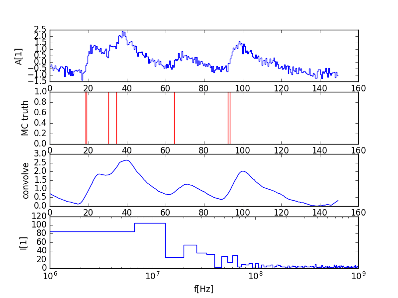

# Single Photon Extractor

A sandbox for investigations and benchmarks of single pulse (photon) extractors for the FACT telescope.
The goal is to have an algorithm which is given a amplitude timeline full of pulses and noise together with a pulse template to look for and than get a list of arrival times for the photons in the timeline. 

## Motivation
Each of FACT's 1440 imaging pixels has a SIPM photo electric converter. The SIPM consists out of 3600 GAPDs which relaese electric pulses when hit by a photon. These pulses among the GAPDs and pixels look very much the same. 

### Hadronic rain
One of Eckart Lorenz last projects was the investigation of something he called 'hadronic rain'. Afaik (told by Adrian and Max A.) hadronic rain is about late cherenkov photons arriving after the main cherenkov light front. Eckart found out in simulations, that these late photons are typical for hadronic showers. In case of FACT we would expect these late cherenkov photons on the falling slope of the main pulse. __Maybe__ we can quantify this hadronic rain with the help of a single photon extractor to improve gamma hadron separation.

### SIPM gain calibration during usual observation
A single photon extractor __might__ be able to make SIPM gain calibration possible on FACT during usual observation in dark nights using the night sky background.

## First Sandbox
```bash
user@machine:~$/single_photon_extractor$ ipython -i sandbox.py 
substract 1.0 at 31.5ns
substract 1.0 at 92.0ns
substract 1.0 at 17.0ns
substract 1.0 at 32.5ns
substract 1.0 at 92.0ns
substract 1.0 at 19.5ns
substract 1.0 at 63.5ns
total photons found:    7.0
total photons injected: 7

```

